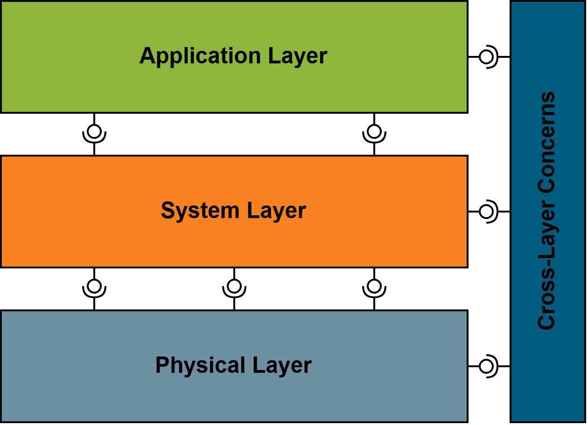

# Introduction and Goals {#section-introduction-and-goals}
The FullStaQD reference architecture is the first step towards a full stack, which ensures compatability and interoperability of various components in the quantum ecosystem. We want to develop a reference architexture with uniform standardised interfaces, which is consistent, modular and open. This reference architecture would reinforce the german quantum computing ecosystem by demonstrating the technical feasibility of quantum applications in the german industry, while also covering a wide quantum computing landscape.

The reference architecture is divided into three layers and cross-layer concerns. 

| Module  | Description | 
| ------------- | ------------- | 
| Application Layer | Contains all components on a high-level programming language or algorithmic level  |
| System Layer  | Contains all components to adjust high-level program to the specific hardware and to integrate HPCs |
| Physical Layer  | Contains all components on a physical layer, which indirectly/directly communicated with the quantum backend  |
| Cross-Layer Concerns  | Contains all components like Testing, Benchmarking, Simulations, Tools, Visualization, ...  |

## Requirements Overview {#_requirements_overview}
To establish a solid foundation for the reference architecture and ensure alignment across all stakeholders, we are now defining the key requirements that will guide its design and implementation.

| Requirement  | Description | 
| ------------- | ------------- | 
| Open Source  | The reference architecture and most of its building blocks in the layers are open source |
| Communication | The reference architecture allows changes through communication with the community  |
| Modular  | Systems or whole Layers can be integrated and are exchangeable into the reference architecture using specific interfaces  |

## Quality Goals {#_quality_goals}
To maintain a state of the art reference architecture in the quantum ecosystem, we list a few of our most important quality goals for this architecture.

| Quality Goal  | Description | 
| ------------- | ------------- | 
| Operability  | The reference architecture can be understood, learned, used and is attractive to users from academia and industry  |
| Compatibility  | Systems can be integrated into the reference architecture using specific interfaces  |
| Maintainability  | The reference architecture can be modified, corrected, adapted or improved due to changes in the environment or requirements  |
| Functional Suitability  | The reference architecture provides functions that meet the needs.  |
| Realiability  | The reference architecture can maintain a high level of performance when used under specific conditions  |

## Stakeholders {#_stakeholders}
The FullStaQD reference architecture is designed for research at the university, as well as for practical use of the industry.
For further Information visit our website: LINK

To build a reference architecture, we need to cover problems of the quantum computing eco system, which includes
- the multitude of perspective of stakeholders and use cases
- the multitude of abstractions, where most expertise of stakeholders focuses only a specified area
- the multitude of languages, which are used by the different domain experts  (physicists, software-engineers, mathematicians, ...)
- the rapid advancement in the quantum eco system

## Methodology  
To fulfill the requirements and goals of the architecture, we use various state of the art methods, which are also used to design classical software architecture.

 <!--  Hier könnte man Paper oder Ergebnisse hinten noch als Spalte in Zukunft Verlinken -->
| Method  | Description | Reason | 
| ------------- | ------------- | ------------- | 
| Scenario-based analysis | Using predefined scenarios of use cases on the reference architecture  | To assess how well the reference architecture covers the predefined use cases and to identify the common requirements shared by the components on which those use cases depend |
| Requirement Survey  | Sending surveys to Stakeholders asking for requirements and needs for their components | Obtaining high-level input on the requirements that the reference architecture must fulfill  |
| Interview with Stakeholders  | In-depth interviews with stakeholders about the reference architecture and their respective positions  | Acquiring detailed insights of Stakeholders and adopt their input  |
| Workshops  | Regular on-site exchange with the consortium  | Updating partners of current status and discussing next steps |
| Community Engagement | Allowing open requests and discussion about the reference architecture through our ticket system | Ensuring external input, extendability and exchangability | 

